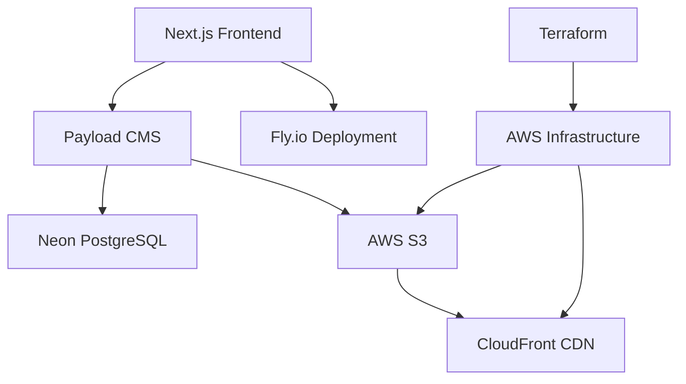

# AUCC - Auckland University Canoe Club Website

[](https://nextjs.org/)
[](https://payloadcms.com/)
[](https://www.typescriptlang.org/)
[](https://tailwindcss.com/)
[](https://opensource.org/licenses/MIT)

> A modern, content-managed website for the Auckland University Canoe Club, built with Next.js 15 and Payload CMS. Developed by WDCC in 2025 with comprehensive handover documentation for future teams.

## 🌊 Project Overview

The AUCC website serves as the digital hub for Auckland University's paddling community, providing:

- **Event Management**: Upcoming trips, registrations, and activity showcases
- **Trip Reports**: Community-generated content with photo galleries
- **River Guides**: Comprehensive information on paddling locations
- **Member Profiles**: Executive team information and club history
- **Content Management**: Intuitive CMS for easy site maintenance

## 🛠 Technology Stack

| Component           | Technology          | Version | Purpose                               |
| ------------------- | ------------------- | ------- | ------------------------------------- |
| **Frontend**        | Next.js             | 15.2.3  | React framework with App Router       |
| **CMS**             | Payload CMS         | 3.30.0  | Headless content management           |
| **Database**        | Neon Postgres       | Latest  | Serverless PostgreSQL                 |
| **Styling**         | Tailwind CSS        | 4.0.15  | Utility-first CSS framework           |
| **Storage**         | AWS S3 + CloudFront | N/A     | Media storage and CDN                 |
| **Deployment**      | Fly.io              | N/A     | Cloud deployment platform             |
| **Infrastructure**  | Terraform           | 1.2.0+  | Infrastructure as Code                |
| **Package Manager** | pnpm                | 10.5.2  | Fast, efficient dependency management |
| **Type Safety**     | TypeScript          | 5.7.3   | Static type checking                  |

### Key Dependencies

```json
{
  "@payloadcms/db-postgres": "3.30.0",
  "@payloadcms/next": "3.30.0",
  "@payloadcms/richtext-lexical": "3.30.0",
  "@payloadcms/storage-s3": "3.30.0",
  "@t3-oss/env-nextjs": "^0.12.0",
  "react": "19.0.0",
  "tailwindcss": "^4.0.15"
}
```

## 🏗 Architecture Overview



**Data Flow:**

1. Content managers create content via Payload CMS admin panel
2. Content stored in Neon Postgres, media in AWS S3
3. Next.js fetches data at build/request time
4. Static/dynamic pages served via Fly.io

## 🚀 Quick Start

### Prerequisites

- **Node.js** 22.14.0+ (managed with Volta)
- **pnpm** 10.5.2+
- **Git**
- **VS Code** (recommended)

### Setup

1. **Clone and install**

   ```bash
   git clone https://github.com/UoaWDCC/aucc.git
   cd aucc
   pnpm install
   ```

2. **Environment setup**

   ```bash
   cp .env.example .env.local
   # Configure required environment variables (see .env.example)
   ```

3. **Start development**

   ```bash
   pnpm dev
   ```

4. **Access the application**
   - **Frontend**: <http://localhost:3000>
   - **Admin Panel**: <http://localhost:3000/admin>

## 📁 Project Structure

```text
aucc/
├── 📁 src/
│   ├── 📁 app/                    # Next.js App Router
│   │   ├── 📁 (frontend)/         # Public website
│   │   │   ├── 📁 _components/    # Shared components
│   │   │   ├── 📁 about/          # About page
│   │   │   ├── 📁 events/         # Events & trips
│   │   │   ├── 📁 home/           # Landing page
│   │   │   ├── 📁 rivers/         # River guides
│   │   │   └── 📁 trip-reports/   # Community reports
│   │   ├── 📁 (payload)/          # CMS admin
│   │   └── 📁 api/                # API routes
│   ├── 📁 collections/            # CMS content schemas
│   ├── 📁 components/             # Reusable UI components
│   ├── 📁 globals/                # Global CMS settings
│   ├── 📁 lib/                    # Utilities & config
│   └── 📁 queries/                # Data fetching
├── 📁 terraform/                  # AWS infrastructure
├── 📁 stories/                    # Storybook components
└── 📄 Configuration files
```

## 🎯 Development Workflow

### Essential Commands

```bash
# Development
pnpm dev                    # Start dev server with Turbopack
pnpm build                  # Production build
pnpm start                  # Start production server

# Code Quality
pnpm lint                   # ESLint checks
pnpm format                 # Prettier formatting
pnpm test                   # Run Vitest tests
pnpm test:coverage          # Test coverage report

# CMS Management
pnpm payload generate:types # Generate TypeScript types
pnpm payload migrate        # Database migrations

# Component Development
pnpm storybook              # Start Storybook dev server
pnpm build-storybook        # Build Storybook
```

### Component Organization

- **Shared components**: `app/(frontend)/_components/`
- **Page-specific components**: `app/(frontend)/[page]/_components/`
- **Reusable UI**: `components/`

### Coding Standards

- **Files**: PascalCase for components, kebab-case for pages
- **Imports**: Organized (React → Next.js → Third-party → Internal)
- **Styling**: Tailwind classes with consistent utility ordering
- **Types**: TypeScript interfaces for all component props

## 🌐 Deployment

### Fly.io (Production)

- **Platform**: Fly.io Sydney region
- **Auto-deploy**: Connected to `main` branch via GitHub Actions
- **Build Command**: `pnpm run build`
- **Node Version**: 22.14.0
- **Configuration**: `fly.staging.toml` (production config)
- **Environment Variables**: Managed via Fly secrets

### Fly.io Commands

```bash
# Deploy to production
flyctl deploy

# Check deployment status
flyctl status

# View logs
flyctl logs
```

### AWS Infrastructure

```bash
cd terraform
terraform init
terraform plan -var-file="prod.tfvars"
terraform apply -var-file="prod.tfvars"
```

**Resources Managed:**

- S3 bucket for media storage
- CloudFront distribution for CDN
- IAM roles and policies

## 📖 Content Management

### Collections

- **Events**: Trip planning and registration
- **Trip Reports**: Community-generated content
- **Rivers**: Paddling location guides
- **Gallery**: Photo management
- **Users**: Member and admin management

### Global Settings

- **Events Global**: Event page configuration
- **Rivers Global**: River guide settings
- **Gear Hire Global**: Equipment rental info

## 🧪 Testing

- **Unit Tests**: Vitest for utilities and components
- **Integration Tests**: Payload CMS API endpoints
- **E2E Tests**: Playwright (planned)
- **Component Tests**: Storybook for visual testing

## 🔧 Maintenance

### Regular Tasks

- **Dependencies**: Update monthly with security patches
- **Types**: Regenerate after CMS schema changes
- **Builds**: Monitor Fly.io deployment status
- **Database**: Regular Neon Postgres maintenance

### Monitoring

- **Performance**: Lighthouse CI in production
- **Errors**: Fly.io error tracking and logs
- **Uptime**: Built-in Fly.io monitoring

## 👥 Team Handover

### 2025 Team

| Name                    | Role            |
| ----------------------- | --------------- |
| David Zhu               | Project Manager |
| Phawat Saengsiripongpun | Tech Lead       |
| Franck Chen             | Developer       |
| Henri Chemla            | Developer       |
| Troy Abbott             | Developer       |
| Ava Lee                 | Developer       |
| Dom Pietersen           | Developer       |
| Lawrence Li             | Developer       |
| Mai Pham                | Developer       |
| Hanna Lin               | Designer        |

### Documentation

- **Comprehensive Handover**: [README_HANDOVER.md](./README_HANDOVER.md)
- **Production Assessment**: [PRODUCTION_ASSESSMENT.md](./PRODUCTION_ASSESSMENT.md)
- **Architecture Documentation**: [docs/ARCHITECTURE.md](./docs/ARCHITECTURE.md)
- **Onboarding Guide**: [GitHub Wiki](https://github.com/UoaWDCC/aucc/wiki/Onboarding-Guide)

## 📞 Support & Resources

### Documentation Links

- [Next.js 15 Documentation](https://nextjs.org/docs)
- [Payload CMS Documentation](https://payloadcms.com/docs)
- [Tailwind CSS Documentation](https://tailwindcss.com/docs)
- [Fly.io Deployment Guide](https://fly.io/docs)

### Getting Help

1. **Wiki**: Check the [GitHub Wiki](https://github.com/UoaWDCC/aucc/wiki) for detailed guides
2. **Issues**: Create GitHub issues for bugs or feature requests
3. **WDCC**: Contact the Web Development and Consulting Club
4. **Documentation**: Review the comprehensive handover documentation

## 📄 License

This project is licensed under the MIT License - see the [LICENSE](LICENSE) file for details.

---

Built with ❤️ by WDCC for the Auckland University Canoe Club
