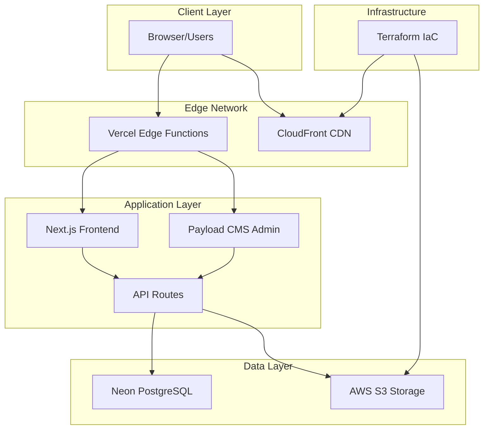
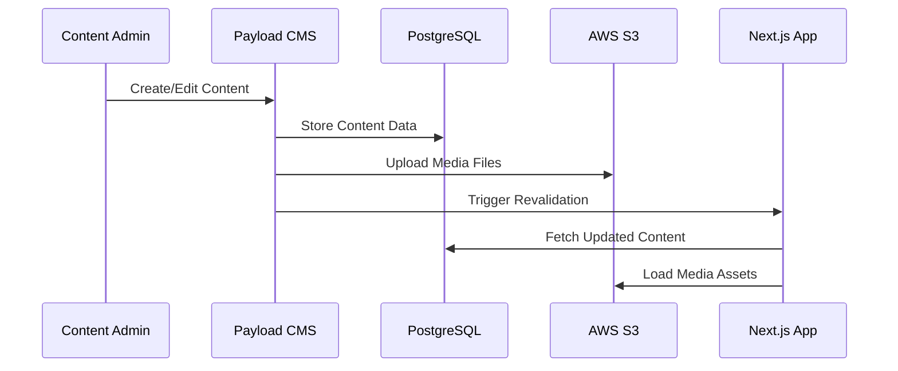
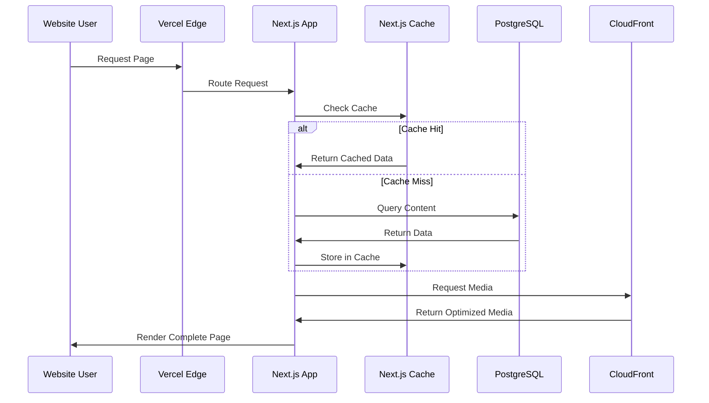

# AUCC Project Architecture Documentation

> **Comprehensive architectural blueprint for the Auckland University Canoe Club website**  
> Built with Next.js 15 and Payload CMS - Generated for 2025 team handover

## 🏗 Architecture Overview

### Architectural Pattern: **Layered Architecture with Headless CMS**

The AUCC website implements a modern **layered architecture** with clear separation of concerns, combining:

- **Presentation Layer**: Next.js 15 frontend with App Router
- **Content Layer**: Payload CMS as headless content management
- **Data Layer**: Neon PostgreSQL with Drizzle ORM
- **Storage Layer**: AWS S3 with CloudFront CDN
- **Infrastructure Layer**: Terraform-managed AWS resources

### High-Level System Diagram



## 🧱 Core Architectural Components

### 1. Frontend Architecture (Next.js App Router)

**Purpose**: Serves the public website with optimal performance and SEO

**Structure**:

```typescript
// Route Groups for Organization
src/app/
├── (frontend)/     // Public website routes
├── (payload)/      // CMS admin interface
└── api/           // API endpoints
```

**Key Patterns**:

- **App Router**: File-system based routing with nested layouts
- **Server Components**: Default rendering for optimal performance
- **Static Generation**: Build-time generation for cacheable content
- **Incremental Static Regeneration**: Dynamic updates for CMS content

**Implementation Example**:

```typescript
// app/(frontend)/layout.tsx - Root layout pattern
export default async function RootLayout({ children }: { children: React.ReactNode }) {
  return (
    <html lang="en">
      <body className="flex min-h-dvh flex-col">
        <Navbar />
        <main className="flex-grow">{children}</main>
        <Footer />
      </body>
    </html>
  )
}
```

### 2. Content Management Architecture (Payload CMS)

**Purpose**: Provides headless CMS capabilities with admin interface

**Core Configuration**:

```typescript
// payload.config.ts - Central configuration
export default buildConfig({
  admin: { user: Users.slug },
  collections: [
    Users,
    Media,
    Rivers,
    Events,
    TripReports,
    Execs,
    Gallery,
    Tags,
  ],
  globals: [EventsGlobal, TripReportsGlobal, RiversGlobal, GearHireGlobal],
  editor: lexicalEditor({}),
  db: postgresAdapter({ pool: { connectionString: env.DATABASE_URL } }),
  plugins: [s3Storage({ collections: { media: { prefix: 'media' } } })],
})
```

**Collection Architecture**:

- **Users**: Authentication and authorization
- **Media**: File management with S3 integration
- **Content Collections**: Events, Rivers, Trip Reports, Gallery
- **Metadata Collections**: Tags, Execs (executive profiles)
- **Global Settings**: Page-level configuration

### 3. Data Access Layer

**Purpose**: Abstracts database operations and provides type-safe data fetching

**Query Pattern**:

```typescript
// queries/events.ts - Standardized query pattern
export const getEvents = unstable_cache(
  async function ({ page = 1, limit = 10, sort = '-startTime' } = {}) {
    const payload = await getPayloadClient()
    const { docs, hasNextPage, nextPage, totalDocs } = await payload.find({
      collection: 'events',
      page,
      limit,
      sort,
    })
    return { events: docs as EventDTO[], hasNextPage, nextPage, totalDocs }
  },
  ['events'], // Cache key
  { tags: [cacheTags.events] }, // Revalidation tags
)
```

**Caching Strategy**:

- **unstable_cache**: Next.js built-in caching for data fetching
- **Cache Tags**: Selective revalidation on content updates
- **ISR**: Incremental Static Regeneration for dynamic content

### 4. Component Architecture

**Organization Pattern**:

```
src/
├── components/              # Reusable UI components
├── app/(frontend)/
│   ├── _components/         # Shared frontend components
│   └── [page]/
│       └── _components/     # Page-specific components
```

**Component Structure Standards**:

```typescript
// Standard component pattern
interface ComponentProps {
  title: string
  variant?: 'primary' | 'secondary'
  className?: string
}

export function Component({ title, variant = 'primary', className }: ComponentProps) {
  return (
    <div className={cn(baseStyles, variantStyles[variant], className)}>
      {title}
    </div>
  )
}
```

## 🔄 Data Flow Architecture

### Content Creation Flow



### User Request Flow



## 🏛 Layer Architecture Breakdown

### 1. Presentation Layer (Next.js Frontend)

**Responsibilities**:

- User interface rendering
- Client-side interactions
- Route handling and navigation
- SEO optimization

**Key Technologies**:

- Next.js 15 with App Router
- React 19 Server Components
- Tailwind CSS for styling
- TypeScript for type safety

**Implementation Patterns**:

- Server-first rendering
- Component composition
- Responsive design patterns
- Accessibility compliance

### 2. Application Layer (API Routes & Business Logic)

**Responsibilities**:

- API endpoint management
- Business logic processing
- Data validation
- Authentication/authorization

**Key Files**:

```
src/app/api/
├── webhook/           # Payload CMS webhooks
└── (payload)/
    ├── [...slug]/     # REST API endpoints
    └── graphql/       # GraphQL endpoint
```

### 3. Data Access Layer (Queries & ORM)

**Responsibilities**:

- Database abstraction
- Query optimization
- Data transformation
- Cache management

**Pattern Implementation**:

```typescript
// Consistent query pattern across all collections
export type CollectionDTO = NoNumber<Collection>

export const getCollection = unstable_cache(
  async (params: QueryParams) => {
    const payload = await getPayloadClient()
    return await payload.find({ collection: 'collection-name', ...params })
  },
  ['collection-cache-key'],
  { tags: [cacheTags.collection] },
)
```

### 4. Persistence Layer (Database & Storage)

**Database**: Neon PostgreSQL

- Managed via Drizzle ORM through Payload
- Auto-generated schemas from Payload collections
- Connection pooling for performance

**File Storage**: AWS S3 + CloudFront

- Media files stored in S3 buckets
- CDN distribution via CloudFront
- Automatic image optimization

## 🔌 Integration Patterns

### Payload CMS Integration

**Configuration Pattern**:

```typescript
// Collection definition pattern
export const Collection: CollectionConfig = {
  slug: 'collection-name',
  admin: { useAsTitle: 'title' },
  access: { read: authenticatedOrPublished },
  fields: [
    { name: 'title', type: 'text', required: true },
    { name: 'content', type: 'richText' },
    { name: 'publishedAt', type: 'date' },
  ],
}
```

**Type Generation**:

- Automatic TypeScript type generation from collections
- Type-safe queries and mutations
- Runtime validation with Payload's built-in validators

### AWS S3 Integration

**Storage Configuration**:

```typescript
s3Storage({
  collections: {
    media: {
      prefix: 'media',
      disableLocalStorage: true,
      generateFileURL: ({ filename, prefix }) =>
        `${env.NEXT_PUBLIC_CF_URL}/${prefix}/${filename}`,
    },
  },
})
```

## 🎨 Styling Architecture

### Tailwind CSS System

**Configuration**:

- Utility-first approach
- Custom design tokens in `tailwind.config.ts`
- Consistent spacing and typography scales
- Color palette optimized for accessibility

**Component Styling Pattern**:

```typescript
// Consistent class composition pattern
const componentStyles = cn(
  'base-styles', // Base layout/structure
  'responsive-styles', // Responsive variants
  variant === 'primary' && 'variant-styles',
  className, // Override capability
)
```

## 🔒 Security Architecture

### Authentication & Authorization

**Payload CMS Security**:

- Built-in user authentication
- Role-based access control
- Session management
- CSRF protection

**API Security**:

- Environment variable validation via `@t3-oss/env-nextjs`
- API key authentication for webhooks
- Input validation on all endpoints

### Data Security

**Database Security**:

- Connection string encryption
- Query parameterization (SQL injection prevention)
- Audit trails via Payload's built-in logging

**File Security**:

- S3 bucket policies for access control
- CloudFront signed URLs for private content
- Image optimization and format validation

## 🚀 Performance Architecture

### Caching Strategy

**Multi-Level Caching**:

1. **CDN Level**: CloudFront for static assets
2. **Application Level**: Next.js unstable_cache for data
3. **Database Level**: Neon's connection pooling
4. **Build Level**: Static generation for public content

**Cache Invalidation**:

```typescript
// Selective revalidation via cache tags
export const cacheTags = {
  events: 'events',
  rivers: 'rivers',
  tripReports: 'trip-reports',
  gallery: 'gallery',
} as const
```

### Image Optimization

**Next.js Image Component**:

- Automatic format optimization (WebP, AVIF)
- Responsive image generation
- Lazy loading with intersection observer
- Priority loading for above-the-fold content

## 🧪 Testing Architecture

### Testing Strategy

**Unit Tests** (Vitest):

- Utility function testing
- Component logic testing
- Query function validation

**Integration Tests**:

- API endpoint testing
- Database interaction testing
- CMS integration testing

**Component Testing** (Storybook):

- Visual regression testing
- Component state testing
- Responsive design validation

## 📦 Deployment Architecture

### Vercel Platform

**Build Process**:

1. Dependency installation via pnpm
2. TypeScript compilation and type checking
3. Next.js static generation
4. Asset optimization and bundling

**Environment Management**:

- Separate staging and production environments
- Environment-specific configurations
- Secure secret management

### Infrastructure as Code (Terraform)

**AWS Resource Management**:

```hcl
# Terraform configuration pattern
resource "aws_s3_bucket" "media_bucket" {
  bucket = var.s3_bucket_name
}

resource "aws_cloudfront_distribution" "cdn" {
  origin {
    domain_name = aws_s3_bucket.media_bucket.bucket_regional_domain_name
    origin_id   = "S3-${aws_s3_bucket.media_bucket.id}"
  }
}
```

## 🔧 Development Workflow Architecture

### Development Environment

**Local Development**:

- Hot reloading via Turbopack
- Environment variable validation
- Type checking in watch mode
- Automatic code formatting

**Code Quality Pipeline**:

- ESLint for code quality
- Prettier for formatting
- Husky for pre-commit hooks
- TypeScript for type safety

### Build Pipeline

**Continuous Integration**:

1. Code quality checks (lint, format, type)
2. Test execution (unit, integration)
3. Build verification
4. Deployment to staging
5. Production deployment (manual approval)

## 📈 Monitoring & Observability

### Application Monitoring

**Vercel Analytics**:

- Core Web Vitals tracking
- Performance monitoring
- Error tracking and alerting
- Build and deployment monitoring

**Database Monitoring**:

- Neon's built-in monitoring
- Query performance tracking
- Connection pool monitoring

## 🚀 Scalability Considerations

### Horizontal Scaling

**Vercel Edge Functions**:

- Automatic scaling based on demand
- Global edge distribution
- Serverless function execution

**Database Scaling**:

- Neon's automatic scaling
- Connection pooling optimization
- Read replica potential

### Content Scaling

**CDN Distribution**:

- Global CloudFront distribution
- Cache-optimized content delivery
- Automatic compression and optimization

## 🔮 Future Architecture Considerations

### Planned Enhancements

1. **Progressive Web App (PWA)** features
2. **Advanced caching** with Redis for high-traffic scenarios
3. **Microservices decomposition** for specific high-load features
4. **Real-time features** with WebSocket integration
5. **Advanced analytics** integration

### Extensibility Points

- **Plugin Architecture**: Payload's plugin system for custom functionality
- **API Extensions**: Custom API routes for specialized features
- **Component Library**: Storybook-documented component system
- **Theme System**: Tailwind-based theming for visual customization

---

## 📚 Architecture Decision Records

### ADR-001: Next.js App Router vs Pages Router

**Decision**: Use Next.js 13+ App Router  
**Context**: Need for improved performance and developer experience  
**Consequences**: Better caching, layout systems, and server components support

### ADR-002: Payload CMS vs Headless Alternatives

**Decision**: Payload CMS over Strapi/Contentful  
**Context**: Need for TypeScript-first, developer-friendly CMS  
**Consequences**: Better type safety, local development, and customization

### ADR-003: Monolithic vs Microservices

**Decision**: Monolithic architecture with clear layer separation  
**Context**: Team size and complexity requirements  
**Consequences**: Simpler deployment, better performance for current scale

---

_This architecture documentation serves as the definitive guide for understanding and extending the AUCC website. For implementation details, refer to the comprehensive handover documentation._
